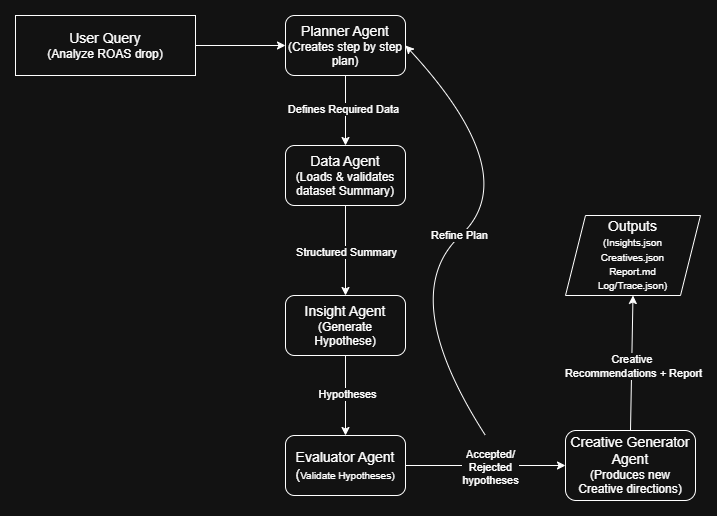
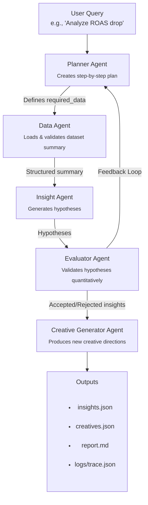

# Agent Graph — Multi-Agent System Architecture

This document describes the full architecture of the multi-agent Facebook Performance Analyst system.  
It includes the diagram, agent roles, data flow, and evaluator-to-planner feedback loop.

---

# 📊 System Diagram

If using a PNG diagram (from draw.io), include it here:

If you prefer Mermaid as a fallback, here is the equivalent diagram:

---

# 🧠 Agent Roles

## 1. Planner Agent
- Receives the user query.
- Breaks it into structured subtasks.
- Specifies required dataset fields.
- Sets success criteria.
- Triggers the full chain.

Outputs: JSON plan with steps.

---

## 2. Data Agent
- Loads `data/sample_data_summary.json`.
- Verifies required fields exist.
- Ensures metrics (CTR, ROAS) are consistent.
- Returns a clean dataset summary for analysis.

Outputs: validated summary JSON.

---

## 3. Insight Agent
- Detects anomalies in CTR, ROAS, spend patterns.
- Generates hypotheses explaining performance issues.
- Assigns initial confidence.
- Converts raw metrics into interpretable explanations.

Outputs: list of hypotheses.

---

## 4. Evaluator Agent
- Applies rule-based evaluation.
- Accepts, rejects, or marks hypotheses inconclusive.
- Adjusts confidence scores.
- Triggers re-planning if insufficient evidence.

Outputs: evaluated hypotheses.

---

## 5. Creative Generator Agent
- Uses creative tokens + low-CTR flags.
- Generates updated creative messaging.
- Produces headlines, primary text, CTAs.
- Supports A/B test suggestions.

Outputs: new creative ideas.

---

# 🔁 Feedback Loop — Evaluator → Planner

The evaluator checks hypothesis confidence.

If:
- confidence < 0.50  
- or hypothesis = inconclusive  

Then:

Evaluator → Planner → Re-plan → Re-run Data + Insight + Evaluator

This makes the system **self-correcting** and genuinely *agentic*.

---

# 🔄 End-to-End Workflow

1. User submits request  
2. Planner creates a multi-step plan  
3. Data Agent loads and validates summary  
4. Insight Agent generates hypotheses  
5. Evaluator scores hypotheses  
6. Creative Agent generates improvements  
7. Outputs created: insights.json, creatives.json, report.md  
8. Low-confidence → system loops back to Planner  

---

# ✅ Summary

This system enables automated marketing analysis through a clear, modular multi-agent design:

**Plan → Load Data → Diagnose → Validate → Improve → Report**  
with intelligent feedback cycles.

The diagram above visualizes the entire agent pipeline and communication flow.
